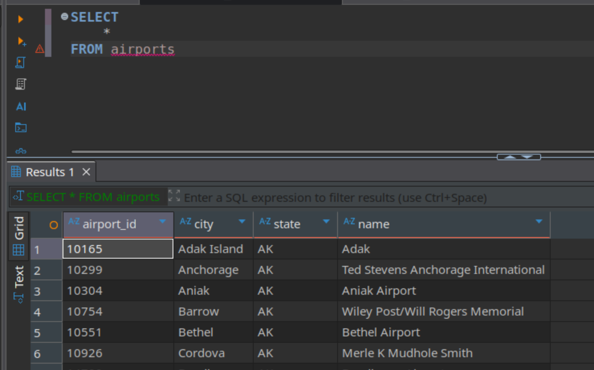
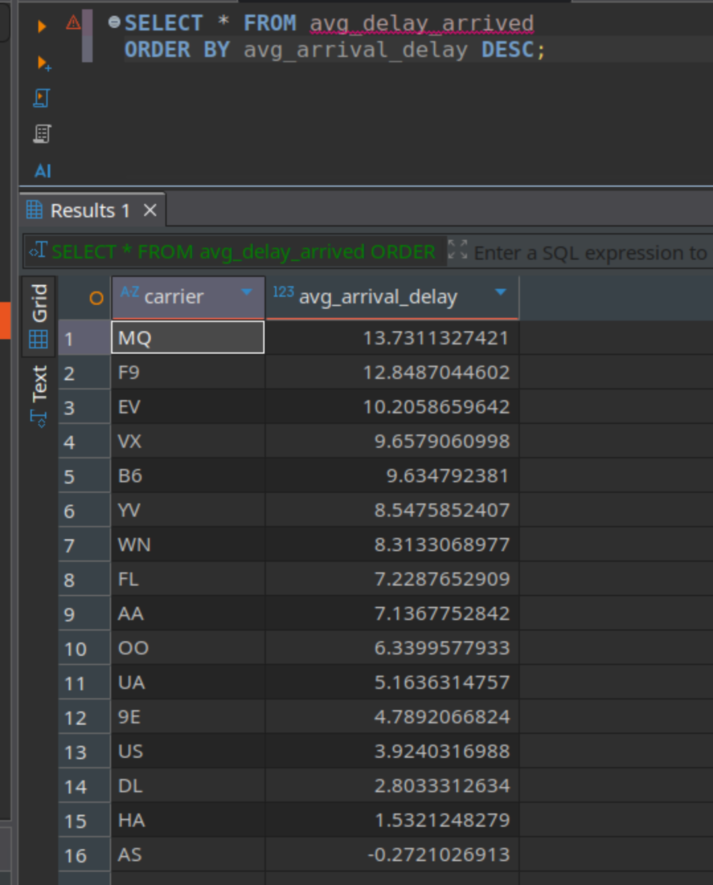
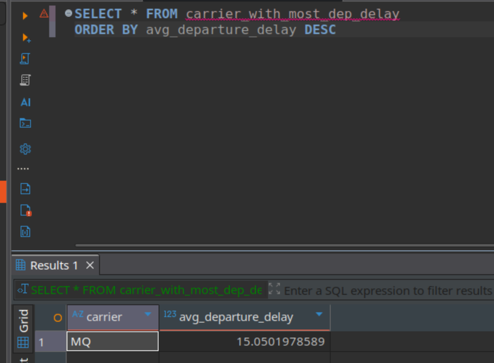
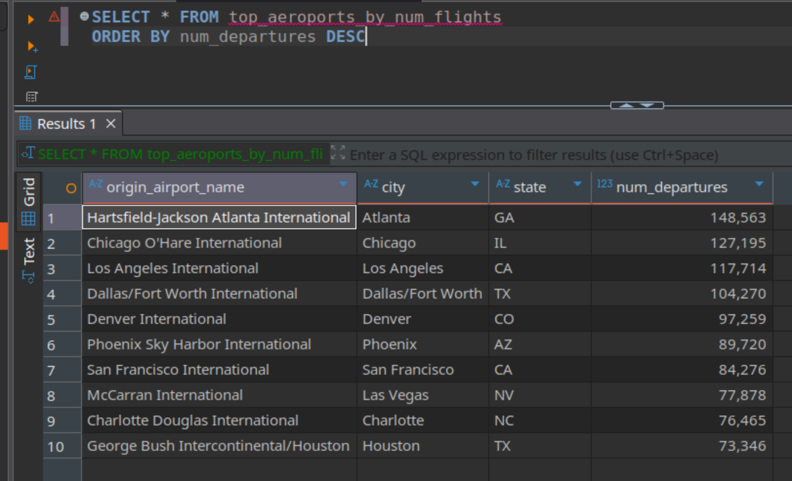
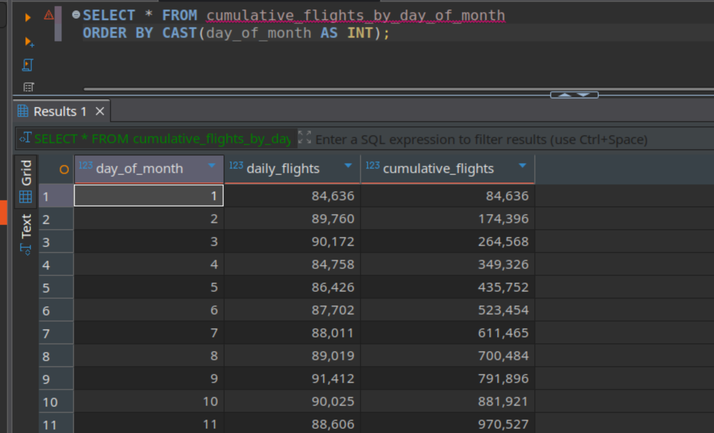
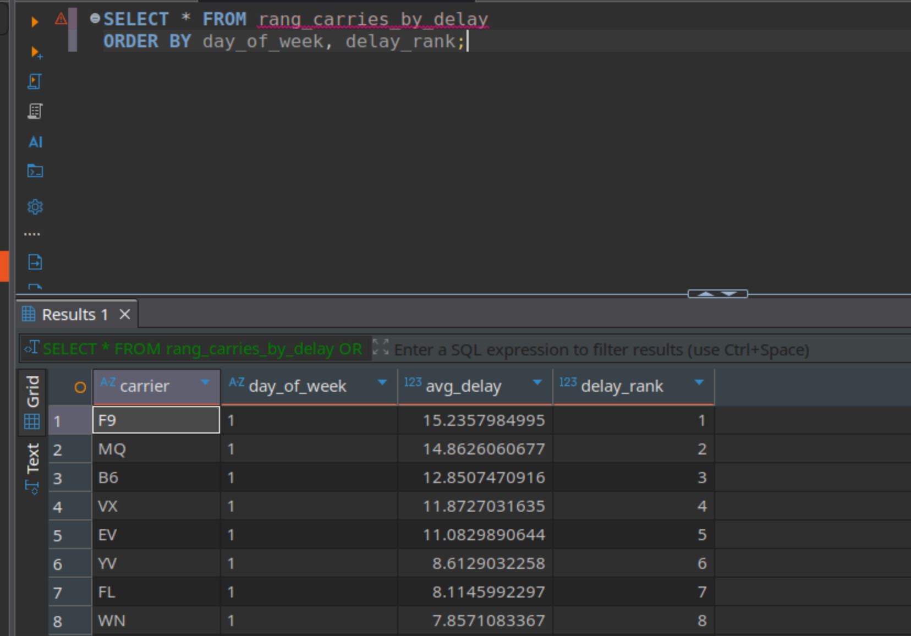

# Отчет по ДЗ 2

## 1. Выбрать любой интересный открытый набор данных для работы (можно воспользоваться сайтом Kaggle, пример набора данных: https://www.kaggle.com/tylerx/flights-and-airports-data). 5 баллов
https://www.kaggle.com/tylerx/flights-and-airports-data и разместил его в папке data
## 2. Создать database в Hive и загрузить туда эти таблицы. 5 баллов

Запуск контейнеров
```
docker compose up -d
```
Подключение к hive, я делал через dbeaver, но можно в консоле, что не очень удобно
```
docker exec -it bigdata_hm_02_hive_server beeline
```
подключение к hive в консоле
```
!connect jdbc:hive2://localhost:10000
```
Создаие базы данных
```
CREATE DATABASE IF NOT EXISTS flights_db LOCATION '/data/warehouse/flights_db';
```
Создание таблицы аэропортов
```
USE flights_db;

CREATE EXTERNAL TABLE airports (
  airport_id INT,
  city STRING,
  state STRING,
  name STRING
)
ROW FORMAT SERDE 'org.apache.hadoop.hive.serde2.OpenCSVSerde'
WITH SERDEPROPERTIES (
  "separatorChar" = ",",
  "quoteChar" = "\"",
  "skip.header.line.count" = "1"
)
STORED AS TEXTFILE
LOCATION '/data/airports_data';
```
Создание таблицы полетов
```
USE flights_db;

CREATE EXTERNAL TABLE flights (
  day_of_month INT,
  day_of_week INT,
  carrier STRING,
  origin_airport_id INT,
  dest_airport_id INT,
  dep_delay INT,
  arr_delay INT
)
ROW FORMAT SERDE 'org.apache.hadoop.hive.serde2.OpenCSVSerde'
WITH SERDEPROPERTIES (
  "separatorChar" = ",",
  "quoteChar" = "\"",
  "skip.header.line.count" = "1"
)
STORED AS TEXTFILE
LOCATION '/data/flights_data';
```
Проверка что данные в таблицах:
таблица аэропортов
```
SELECT 
	* 
FROM airports
```

таблица полетов
```
SELECT 
	* 
FROM flights
```


## 3. На этих данных построить витрины (5-6) с использованием конструкций: where, count, group by, having, order by, join, union, window. 5 баллов

### Средняя задержка прибытия по авиакомпаниям
```
CREATE VIEW avg_delay_arrived as
SELECT
  carrier,
  AVG(arr_delay) AS avg_arrival_delay
FROM flights
WHERE arr_delay IS NOT NULL
GROUP BY carrier
ORDER BY avg_arrival_delay DESC;
```
```
SELECT * FROM avg_delay_arrived 
ORDER BY avg_arrival_delay DESC;
```

#### Описание 
Показывает среднюю задержку прибытия (в минутах) для каждой авиакомпании. Позволяет выявить перевозчиков с наихудшей пунктуальностью и сравнить их производительность. Сортировка по убыванию помогает быстро найти «лидеров» по задержкам.

### Авиакомпании с высокой средней задержкой вылета (> 15 мин)
```
CREATE VIEW carrier_with_most_dep_delay as
SELECT
  carrier,
  AVG(dep_delay) AS avg_departure_delay
FROM flights
WHERE dep_delay IS NOT NULL 
GROUP BY carrier
HAVING AVG(dep_delay) > 15
ORDER BY avg_departure_delay DESC;
```
```
SELECT * FROM carrier_with_most_dep_delay 
ORDER BY avg_departure_delay DESC
```

#### Описание 
Фильтрует только те авиакомпании, у которых средняя задержка вылета превышает 15 минут. Используется для выявления системных проблем у конкретных перевозчиков. Конструкция HAVING позволяет фильтровать агрегированные результаты, а не исходные строки.

### Топ-10 аэропортов по количеству вылетов с названиями
```
CREATE VIEW top_aeroports_by_num_flights AS
SELECT
  a.name AS origin_airport_name,
  a.city,
  a.state,
  COUNT(*) AS num_departures
FROM flights f
JOIN airports a ON f.origin_airport_id = a.airport_id
GROUP BY a.airport_id, a.name, a.city, a.state
ORDER BY num_departures DESC
LIMIT 10;
```
```
SELECT * FROM top_aeroports_by_num_flights 
ORDER BY num_departures DESC
```

#### Описание
Отображает 10 самых загруженных аэропортов по числу отправленных рейсов, с указанием названия, города и штата. Используется для анализа трафика и выявления ключевых транспортных узлов. Достижимо за счёт JOIN между таблицами рейсов и справочника аэропортов

### Накопительное количество рейсов по дням месяца
```
CREATE VIEW cumulative_flights_by_day_of_month AS
SELECT
  CAST(day_of_month AS INT) AS day_of_month,
  COUNT(*) AS daily_flights,
  SUM(COUNT(*)) OVER (ORDER BY CAST(day_of_month AS INT) ROWS UNBOUNDED PRECEDING) AS cumulative_flights
FROM flights
GROUP BY day_of_month 
ORDER BY CAST(day_of_month AS INT);
```
```
SELECT * FROM cumulative_flights_by_day_of_month 
ORDER BY CAST(day_of_month AS INT);
```

#### Описание
Показывает, как нарастает общее число выполненных рейсов в течение месяца — от первого до последнего дня. Полезно для анализа тенденций (например, рост активности к концу месяца) и прогнозирования нагрузки. Реализовано с помощью оконной агрегатной функции SUM(...) OVER (... ROWS UNBOUNDED PRECEDING), которая вычисляет скользящую (накопительную) сумму.

### Ранжирование авиакомпаний по задержкам
```
CREATE VIEW rang_carries_by_delay AS
SELECT
  carrier,
  day_of_week,
  AVG(arr_delay) AS avg_delay,
  RANK() OVER (PARTITION BY day_of_week ORDER BY AVG(arr_delay) DESC) AS delay_rank
FROM flights
WHERE arr_delay IS NOT NULL
GROUP BY carrier, day_of_week
ORDER BY day_of_week, delay_rank;
```
```
SELECT * FROM rang_carries_by_delay 
ORDER BY day_of_week, delay_rank;
```

#### Описание
Для каждого дня недели (понедельник, вторник и т.д.) показывает, как авиакомпании ранжируются по средней задержке прибытия. Позволяет выявить, например, что в пятницу все авиакомпании летают хуже, или что одна компания стабильно плоха по выходным. Использует оконную функцию RANK() с PARTITION BY для внутригруппового сравнения.