# Отчет по выполнению ДЗ 3

## Этап подготовки базы данных и окружения

1. PosgresDB будет запущен в докер контейнере
2. DBeaver уже установлен
3. Подключение настроено 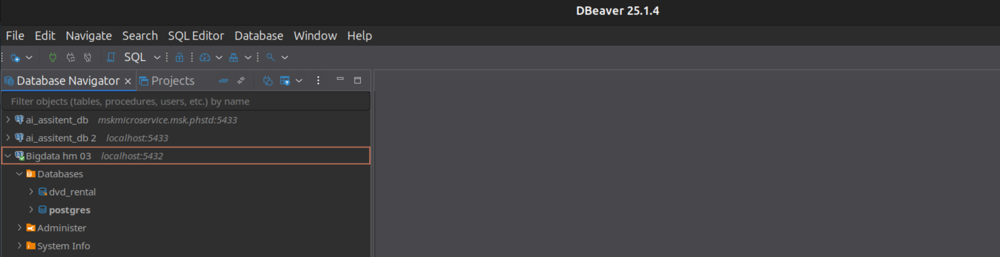
4. Восстановил базу данных
```
# восстановление базы данных из бекапа
docker exec -i bigdata_hm3_db pg_restore -U postgres -d dvd_rental --clean --if-exists /backups/dvd-rental.backup
# проверка табличек
docker exec -it bigdata_hm3_db psql -U postgres -d dvd_rental -c "\dt"
# вывод
             List of relations
 Schema |     Name      | Type  |  Owner   
--------+---------------+-------+----------
 public | actor         | table | postgres
 public | address       | table | postgres
 public | author        | table | postgres
 public | category      | table | postgres
 public | city          | table | postgres
 public | country       | table | postgres
 public | customer      | table | postgres
 public | film          | table | postgres
 public | film_actor    | table | postgres
 public | film_category | table | postgres
 public | inventory     | table | postgres
 public | language      | table | postgres
 public | orders        | table | postgres
 public | payment       | table | postgres
 public | rental        | table | postgres
 public | staff         | table | postgres
 public | store         | table | postgres
```
5. ER-диаграмма
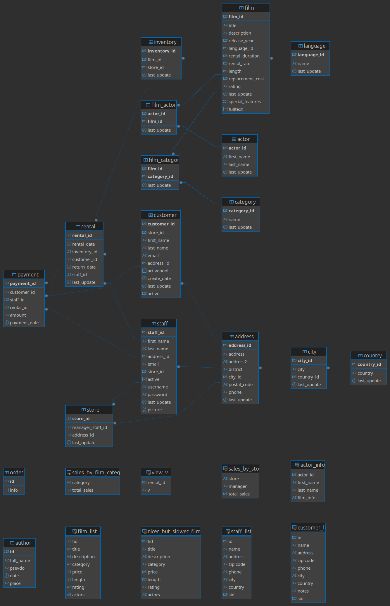

## Этап SQL и получение данных

1. Вывести список всех клиентов (таблица customer).
```
SELECT * FROM public.customer;
```
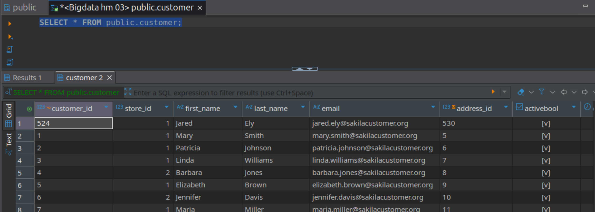

2. Вывести имена и фамилии клиентов с именем Carolyn.
```
SELECT 
    first_name, 
    last_name 
FROM public.customer 
WHERE 
    first_name='Carolyn';
```
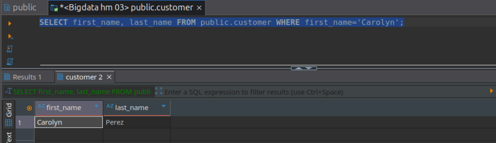

3. Вывести полные имена клиентов (имя + фамилия в одной колонке), у которых имя или фамилия содержат подстроку ary (например: Mary, Geary).
```
SELECT 
    first_name || ' ' || last_name as full_name 
FROM public.customer 
WHERE 
    first_name ILIKE '%ary%' OR last_name ILIKE '%ary%';
```
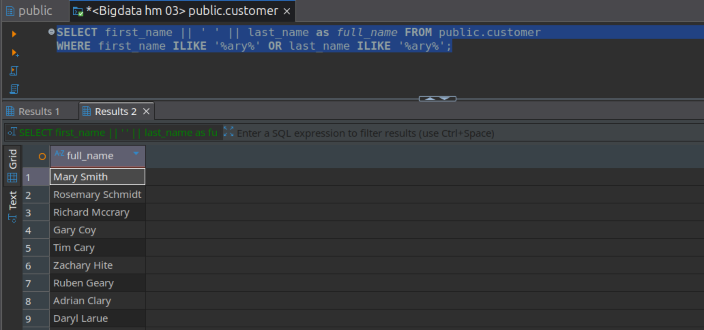

4. Вывести 20 самых крупных транзакций (таблица payment).
```
select 
    * 
from public.payment 
order by amount desc 
limit 20
```
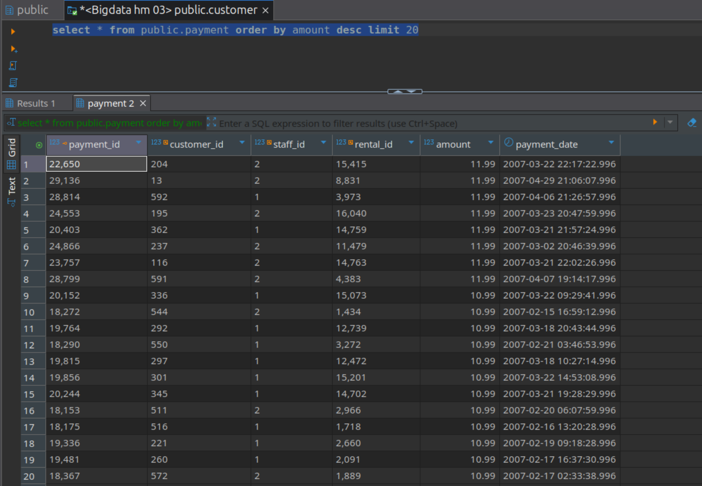

5. Вывести адреса всех магазинов, используя подзапрос.
```
select 
    address 
from public.address 
where 
    address_id in (
        select 
            address_id 
        from public.store
    )
```


6. Для каждой оплаты вывести число, месяц и день недели в числовом формате (Понедельник – 1, Вторник – 2 и т.д.).
```
select 
    payment_id,
    amount,
    date_part('day', payment_date) as day,
    date_part('month', payment_date)  as month,
    extract(DOW from payment_date) + 1 as weekday 
from public.payment
```
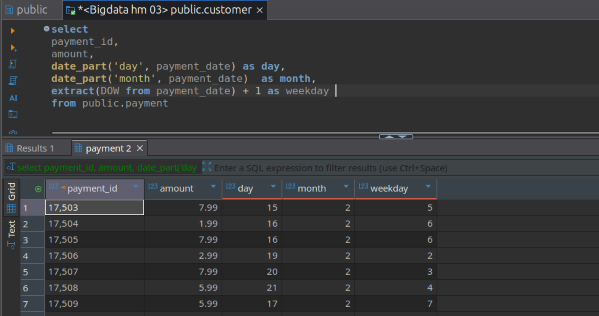

7. Вывести, кто (customer_id), когда (rental_date, приведенная к типу date) и у кого (staff_id) брал диски в аренду в июне 2005 года.
```
select 
    customer_id, 
    rental_date::date as rental_date, 
    staff_id 
from public.rental
where 
    rental_date >= '2005-06-01' and rental_date < '2005-07-01'
```
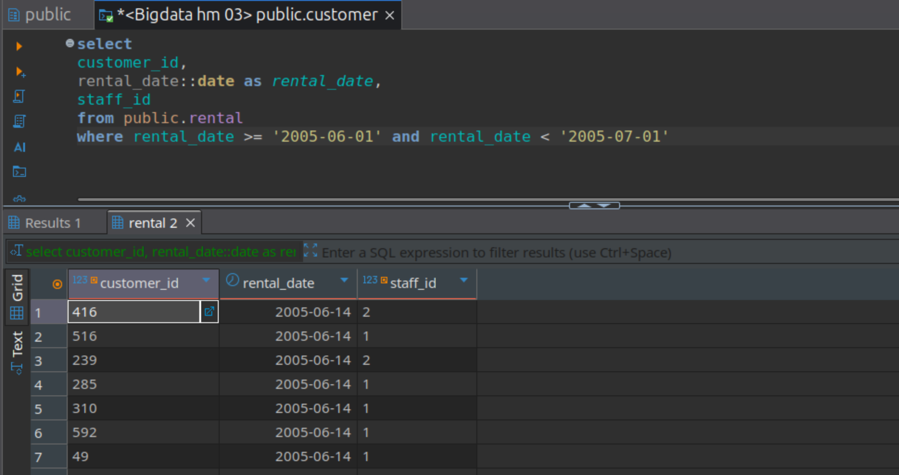

8. Вывести название, описание и длительность фильмов (таблица film), выпущенных после 2000 года, с длительностью от 60 до 120 минут включительно. Показать первые 20 фильмов с наибольшей длительностью.
```
select 
	title, description, length 
from public.film
where 
	release_year > 2000 and length between 60 and 120
order by length desc 
limit 20
```
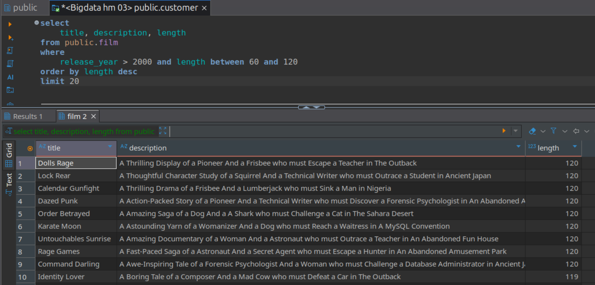

9. Найти все платежи (таблица payment), совершенные в апреле 2007 года, стоимость которых не превышает 4 долларов. Вывести идентификатор платежа, дату (без времени) и сумму платежа. Отсортировать платежи по убыванию суммы, а при равной сумме — по более ранней дате.
```
select 
	payment_id,
	payment_date::date AS payment_date_1,
	amount
from public.payment
where 
	payment_date between '2007-04-01' and '2007-05-01' and
	amount <= 4
order by amount desc, payment_date asc;
```
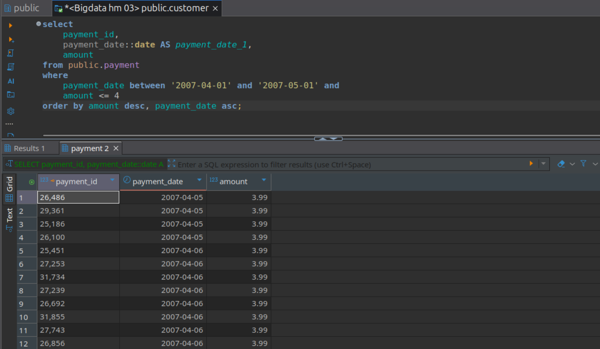

10. Показать имена, фамилии и идентификаторы всех клиентов с именами Jack, Bob или Sara, чья фамилия содержит букву «p». Переименовать колонки: с именем — в «Имя», с идентификатором — в «Идентификатор», с фамилией — в «Фамилия». Отсортировать клиентов по возрастанию идентификатора.
```
select 
	first_name AS "Имя",
	last_name  AS "Фамилия",
	customer_id AS "Идентификатор"
from public.customer 
where 
	first_name in ('Jack', 'Bob', 'Sara') and
	last_name ilike '%p%'
order by 
	customer_id asc
```
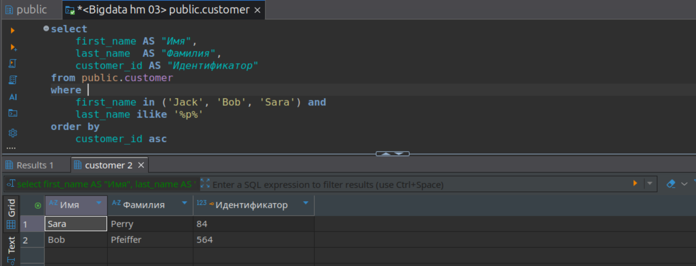

11. Работа с собственной таблицей студентов
Создать таблицу студентов с полями: имя, фамилия, возраст, дата рождения и адрес. Все поля должны запрещать внесение пустых значений (NOT NULL).
```
create table students (
	id serial primary key,
	first_name varchar(100) not null,
	last_name varchar(100) not null,
	age int not null,
	birth_date date not null,
	address varchar(255) not null
)
```
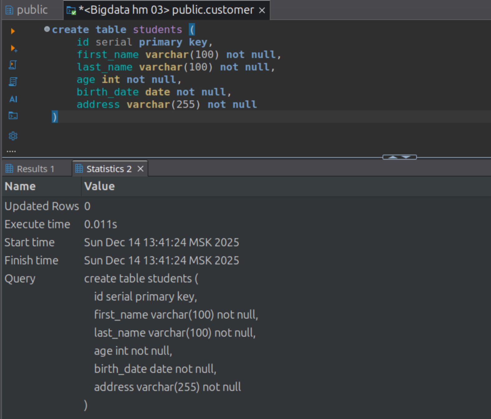
Внести в таблицу одного студента с id > 50.
```
insert into students (
	id, first_name, last_name, age, birth_date, address
) 
values (
	51,
	'John',
	'Johnson',
	'23',
	'2002-01-01',
	'USA, Northstreet Ave'
)
```
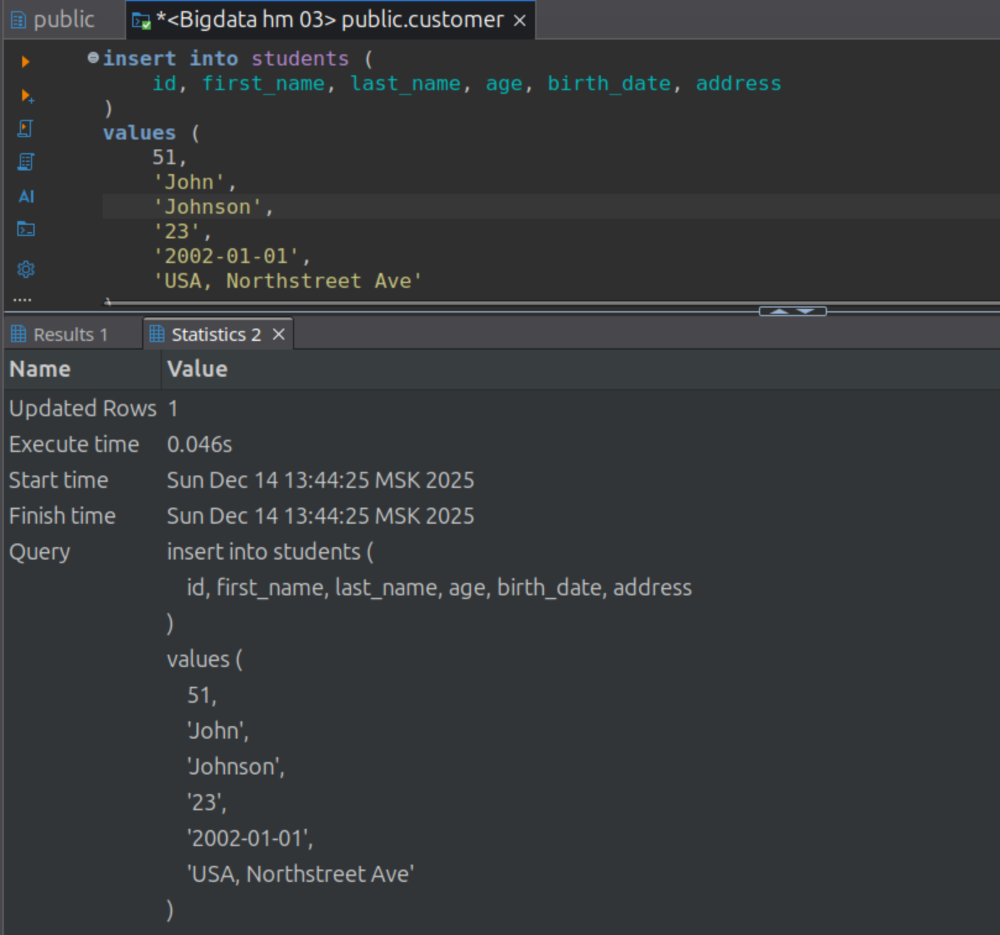

Просмотреть текущие записи таблицы.
```
select 
	* 
from public.students
```
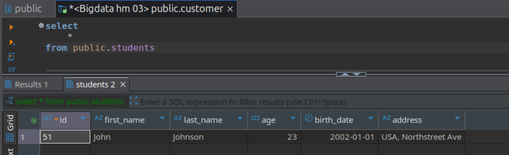

Внести несколько записей одним запросом, используя автоинкремент id.
```
insert into students (
	first_name, last_name, age, birth_date, address
) 
values 
	('Green', 'Smith', '23', '2002-02-01', 'USA, Southstreet Ave'),
	('John', 'Smith', '23', '2002-03-01', 'USA, Weststreet Ave')
```
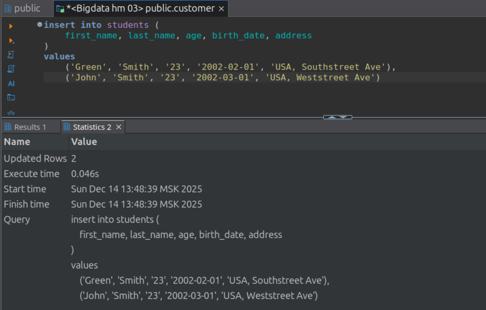

Снова просмотреть текущие записи таблицы.
```
select 
	* 
from public.students
```


Удалить одного выбранного студента.
Вывести полный список студентов.
Удалить таблицу студентов.
Выполнить запрос на выборку из таблицы студентов и вывести его результат (показать, что таблица удалена).
