# Отчет по выполнению ДЗ 3

## Этап подготовки базы данных и окружения

1. PosgresDB будет запущен в докер контейнере
2. DBeaver уже установлен
3. Подключение настроено 
4. Восстановил базу данных
```
# восстановление базы данных из бекапа
docker exec -i bigdata_hm3_db pg_restore -U postgres -d dvd_rental --clean --if-exists /backups/dvd-rental.backup
# проверка табличек
docker exec -it bigdata_hm3_db psql -U postgres -d dvd_rental -c "\dt"
# вывод
             List of relations
 Schema |     Name      | Type  |  Owner   
--------+---------------+-------+----------
 public | actor         | table | postgres
 public | address       | table | postgres
 public | author        | table | postgres
 public | category      | table | postgres
 public | city          | table | postgres
 public | country       | table | postgres
 public | customer      | table | postgres
 public | film          | table | postgres
 public | film_actor    | table | postgres
 public | film_category | table | postgres
 public | inventory     | table | postgres
 public | language      | table | postgres
 public | orders        | table | postgres
 public | payment       | table | postgres
 public | rental        | table | postgres
 public | staff         | table | postgres
 public | store         | table | postgres
```
5. ER-диаграмма


## Этап SQL и получение данных

1. Вывести список всех клиентов (таблица customer).
```
SELECT * FROM public.customer;
```


2. Вывести имена и фамилии клиентов с именем Carolyn.
```
SELECT 
    first_name, 
    last_name 
FROM public.customer 
WHERE 
    first_name='Carolyn';
```


3. Вывести полные имена клиентов (имя + фамилия в одной колонке), у которых имя или фамилия содержат подстроку ary (например: Mary, Geary).
```
SELECT 
    first_name || ' ' || last_name as full_name 
FROM public.customer 
WHERE 
    first_name ILIKE '%ary%' OR last_name ILIKE '%ary%';
```


4. Вывести 20 самых крупных транзакций (таблица payment).
```
select 
    * 
from public.payment 
order by amount desc 
limit 20
```


5. Вывести адреса всех магазинов, используя подзапрос.
```
select 
    address 
from public.address 
where 
    address_id in (
        select 
            address_id 
        from public.store
    )
```


6. Для каждой оплаты вывести число, месяц и день недели в числовом формате (Понедельник – 1, Вторник – 2 и т.д.).
```
select 
    payment_id,
    amount,
    date_part('day', payment_date) as day,
    date_part('month', payment_date)  as month,
    extract(DOW from payment_date) + 1 as weekday 
from public.payment
```


7. Вывести, кто (customer_id), когда (rental_date, приведенная к типу date) и у кого (staff_id) брал диски в аренду в июне 2005 года.
```
select 
    customer_id, 
    rental_date::date as rental_date, 
    staff_id 
from public.rental
where 
    rental_date >= '2005-06-01' and rental_date < '2005-07-01'
```


8. Вывести название, описание и длительность фильмов (таблица film), выпущенных после 2000 года, с длительностью от 60 до 120 минут включительно. Показать первые 20 фильмов с наибольшей длительностью.
```
select 
	title, description, length 
from public.film
where 
	release_year > 2000 and length between 60 and 120
order by length desc 
limit 20
```


9. Найти все платежи (таблица payment), совершенные в апреле 2007 года, стоимость которых не превышает 4 долларов. Вывести идентификатор платежа, дату (без времени) и сумму платежа. Отсортировать платежи по убыванию суммы, а при равной сумме — по более ранней дате.
```
select 
	payment_id,
	payment_date::date AS payment_date_1,
	amount
from public.payment
where 
	payment_date between '2007-04-01' and '2007-05-01' and
	amount <= 4
order by amount desc, payment_date asc;
```


10. Показать имена, фамилии и идентификаторы всех клиентов с именами Jack, Bob или Sara, чья фамилия содержит букву «p». Переименовать колонки: с именем — в «Имя», с идентификатором — в «Идентификатор», с фамилией — в «Фамилия». Отсортировать клиентов по возрастанию идентификатора.
```
select 
	first_name AS "Имя",
	last_name  AS "Фамилия",
	customer_id AS "Идентификатор"
from public.customer 
where 
	first_name in ('Jack', 'Bob', 'Sara') and
	last_name ilike '%p%'
order by 
	customer_id asc
```


11. Работа с собственной таблицей студентов
Создать таблицу студентов с полями: имя, фамилия, возраст, дата рождения и адрес. Все поля должны запрещать внесение пустых значений (NOT NULL).
```
create table students (
	id serial primary key,
	first_name varchar(100) not null,
	last_name varchar(100) not null,
	age int not null,
	birth_date date not null,
	address varchar(255) not null
)
```

Внести в таблицу одного студента с id > 50.
```
insert into students (
	id, first_name, last_name, age, birth_date, address
) 
values (
	51,
	'John',
	'Johnson',
	'23',
	'2002-01-01',
	'USA, Northstreet Ave'
)
```


Просмотреть текущие записи таблицы.
```
select 
	* 
from public.students
```


Внести несколько записей одним запросом, используя автоинкремент id.
```
insert into students (
	first_name, last_name, age, birth_date, address
) 
values 
	('Green', 'Smith', '23', '2002-02-01', 'USA, Southstreet Ave'),
	('John', 'Smith', '23', '2002-03-01', 'USA, Weststreet Ave')
```


Снова просмотреть текущие записи таблицы.
```
select 
	* 
from public.students
```


Удалить одного выбранного студента.
```
delete from students 
where id=51
```
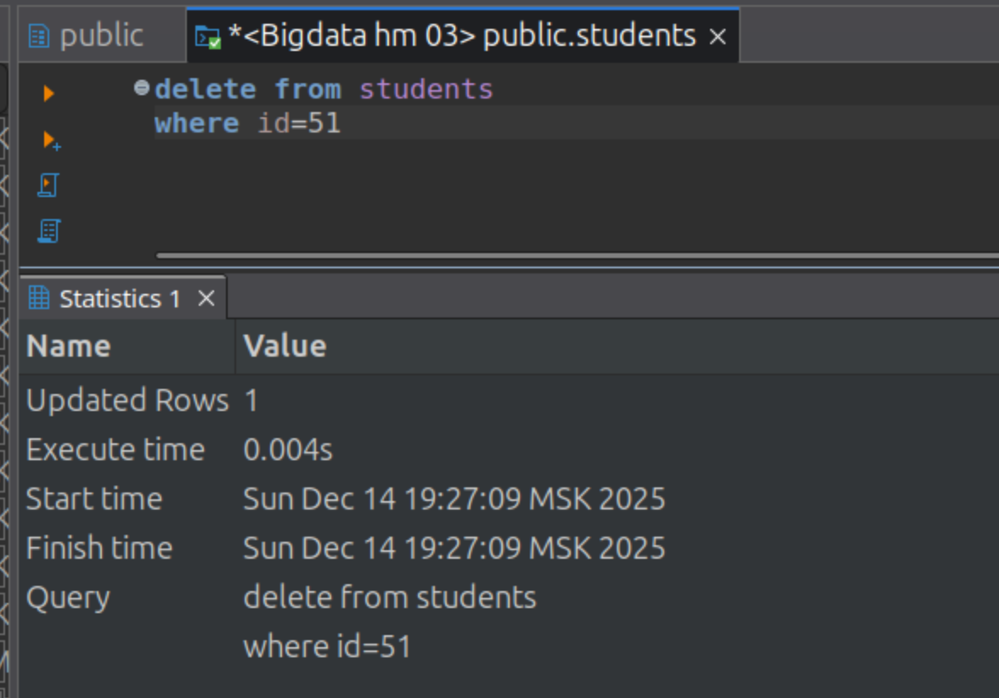

Вывести полный список студентов.
```
select * from students
```
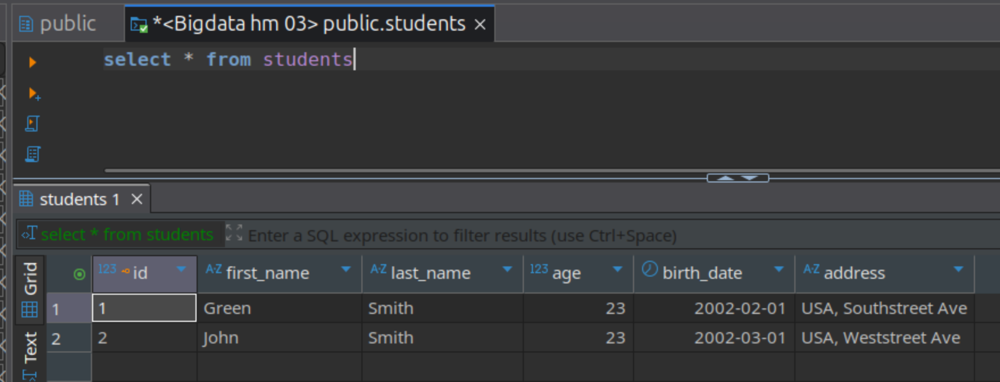

Удалить таблицу студентов.
```
drop table if exists students;
```
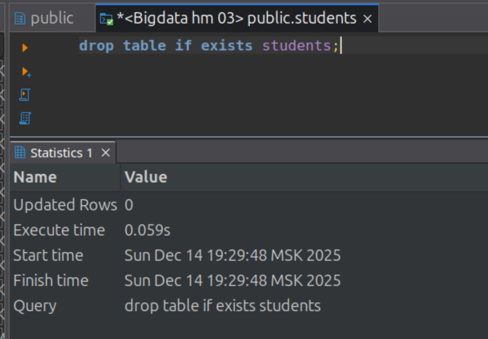

Выполнить запрос на выборку из таблицы студентов и вывести его результат (показать, что таблица удалена).
```
select * from public.students
```
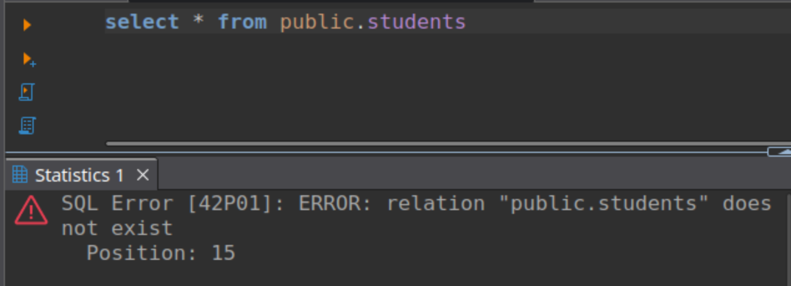


## Этап JOIN и агрегатные функции

12. Вывести количество уникальных имен клиентов.
```
select 
	count(distinct first_name)
from customer
```
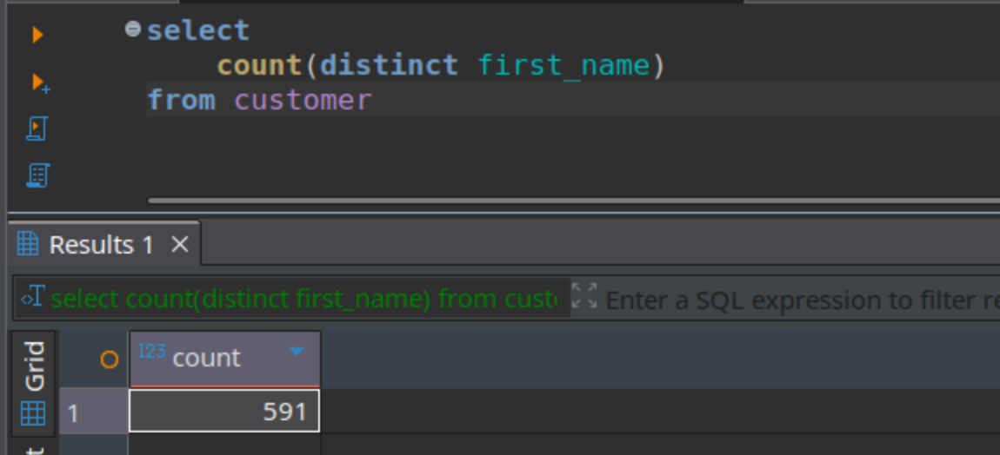

13. Вывести 5 самых часто встречающихся сумм оплаты: саму сумму, даты таких оплат, количество платежей с этой суммой и общую сумму этих платежей.
```
select 
	amount,
	count(*) as payment_count,
	sum(amount) as total_amount,
	array_agg(payment_date) as payment_dates 
from public.payment 
group by amount 
order by payment_count desc 
limit 5
```
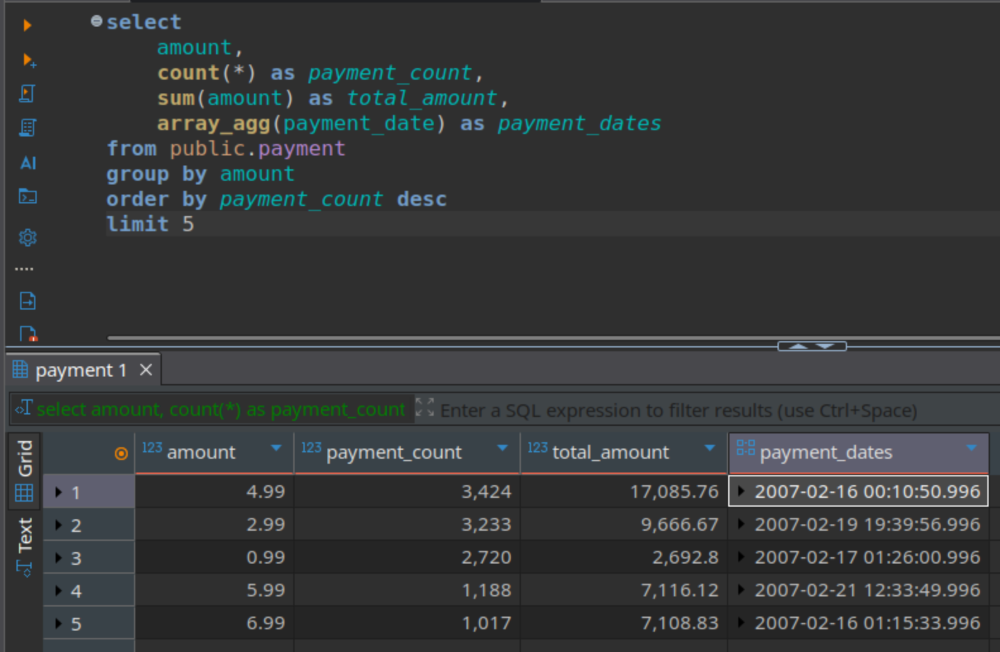

14. Вывести количество ячеек (записей) в инвентаре для каждого магазина.
```
select 
	store_id,
	count(*)
from public.inventory 
group by store_id
```
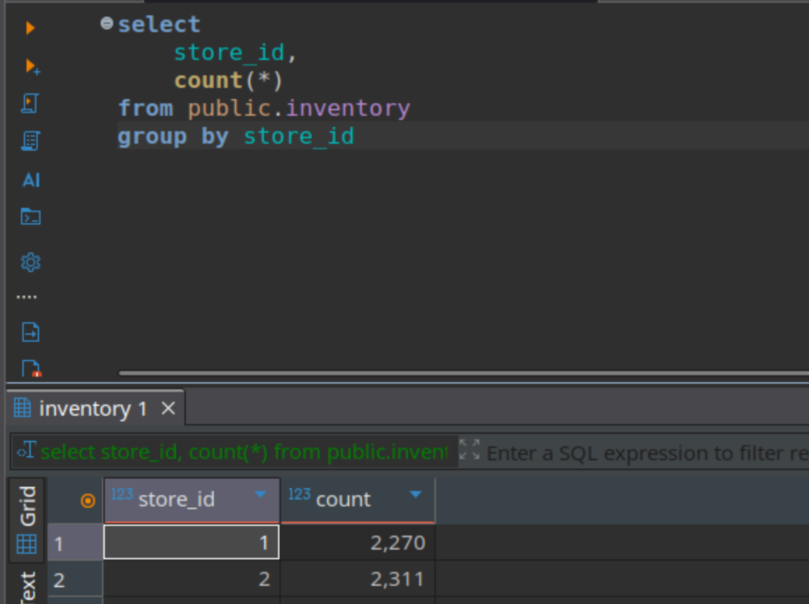

15. Вывести адреса всех магазинов, используя соединение таблиц (JOIN).
```
select 
	s.store_id,
	a.address
from public.store s 
join public.address a 
	on s.address_id = a.address_id 
```
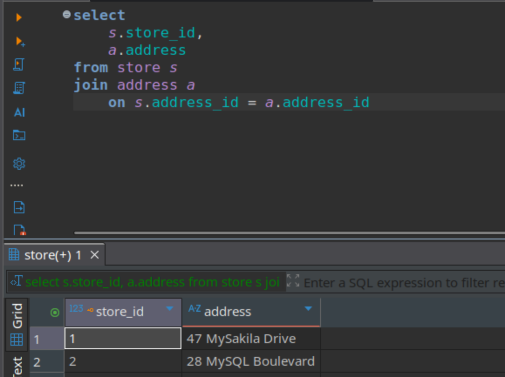

16. Вывести полные имена всех клиентов и всех сотрудников в одну колонку (объединенный список).
```
select first_name || ' ' || last_name as full_name  from public.customer
union all
select first_name || ' ' || last_name as full_name  from public.staff; 
```
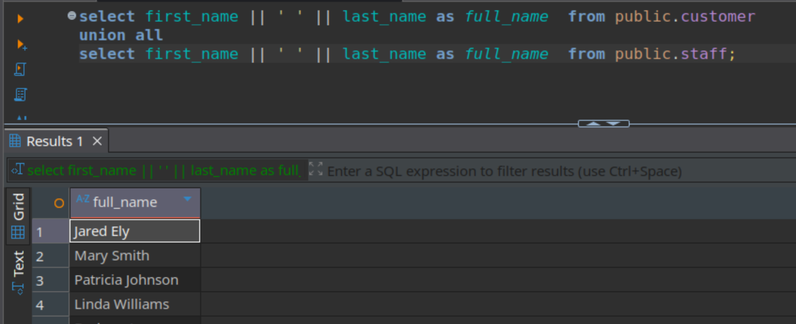

17. Вывести имена клиентов, которые не совпадают ни с одним именем сотрудников (операция EXCEPT или аналог).
```
select 
	distinct first_name
from public.customer
except
	select 
		distinct first_name
	from public.staff
```
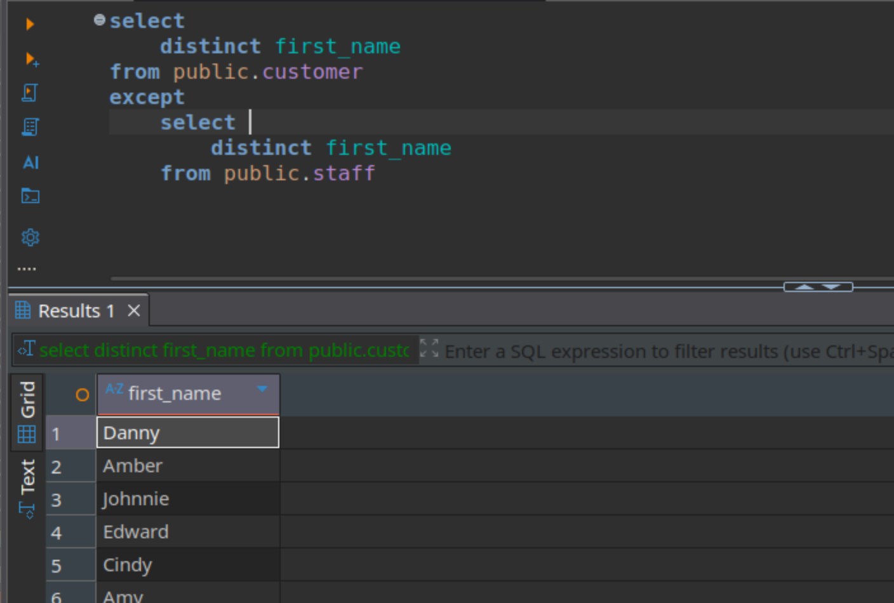

18. Вывести, кто (customer_id), когда (rental_date, приведенная к типу date) и у кого (staff_id) брал диски в аренду в июне 2005 года.
```
select 
    customer_id, 
    rental_date::date as rental_date, 
    staff_id 
from public.rental
where 
    rental_date >= '2005-06-01' and rental_date < '2005-07-01'
```


19. Вывести идентификаторы всех клиентов, у которых 40 и более оплат. Для каждого такого клиента посчитать средний размер транзакции, округлить его до двух знаков после запятой и вывести в отдельном столбце.
```
select 
	customer_id,
	count(*) count_payments,
	round(avg(amount), 2) avg_payment 
from public.payment
group by customer_id
having count(*) >= 40
```
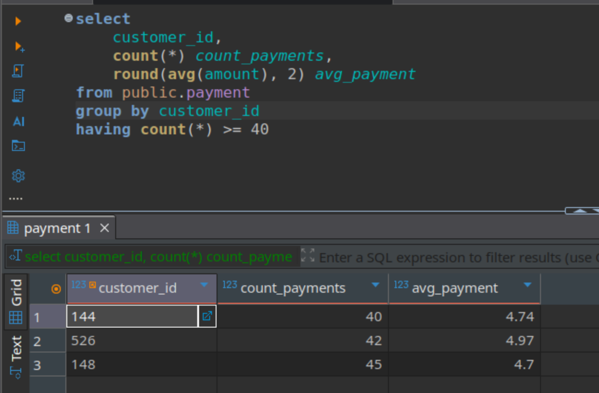

20. Вывести идентификатор актера, его полное имя и количество фильмов, в которых он снялся. Определить актера, снявшегося в наибольшем количестве фильмов (группировать по id актера).
```
select 
	fa.actor_id,
	a.first_name || ' ' || a.last_name as full_name,
	count(*) as count_films 
from public.film_actor fa 
join public.actor a 
on a.actor_id = fa.actor_id 
group by fa.actor_id, full_name
order by count_films desc
```
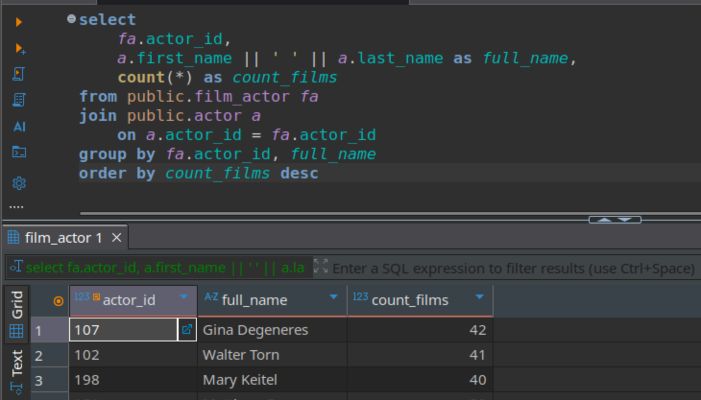

21. Посчитать выручку по каждому месяцу работы проката. Месяц должен определяться по дате аренды (rental_date), а не по дате оплаты (payment_date). Округлить выручку до одного знака после запятой. Отсортировать строки в хронологическом порядке. В отчете должен присутствовать месяц, в который не было выручки (нет данных о платежах).
```
with start_end_months as (
   select date_trunc('month', min(rental_date)) as start_month,
          date_trunc('month', max(rental_date)) as end_month
   from public.rental
), months_in_report as (
   select generate_series(
       (select start_month from start_end_months),
       (select end_month from start_end_months),
       interval '1 month'
   ) as month
), revenue as (
   select
       date_trunc('month', r.rental_date) as month,
       sum(p.amount) as total_revenue
   from public.rental r
   left join public.payment p on r.rental_id = p.rental_id
   group by date_trunc('month', r.rental_date)
)
select
   mr.month,
   round(coalesce(r.total_revenue, 0), 1) as revenue
from months_in_report  mr
left join revenue r using (month)
order by mr.month;
```
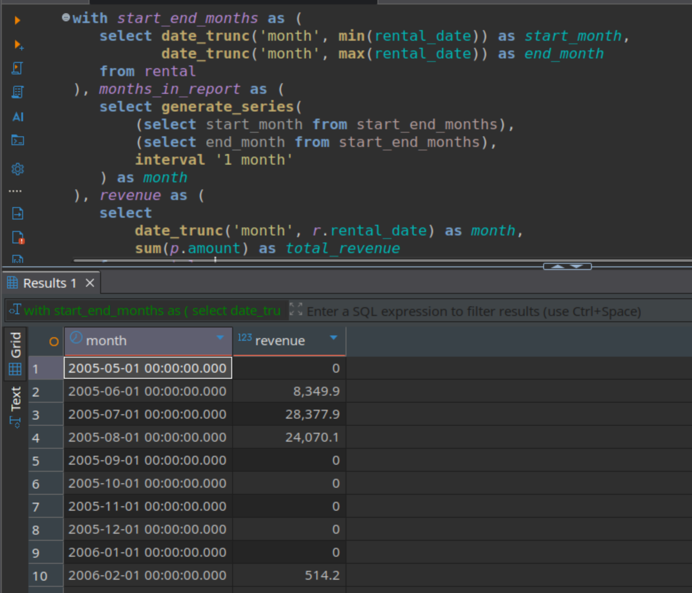

22. Найти средний платеж по каждому жанру фильма. Отобразить только те жанры, к которым относится более 60 различных фильмов. Округлить средний платеж до двух знаков после запятой и дать понятные названия столбцам. Отсортировать жанры по убыванию среднего платежа.
```
select
	c.name genre,
	round(avg(p.amount), 2) as avg_payment 
from public.category c 
join public.film_category fc 
	on fc.category_id = c.category_id 
	join public.inventory i 
		on i.film_id = fc.film_id 
		join public.rental r 
			on r.inventory_id = i.inventory_id 
			join public.payment p 
				on p.rental_id = r.rental_id 
group by c.name
having count(distinct fc.film_id ) > 60 
order by avg_payment desc
```


23. Определить, какие фильмы чаще всего берут напрокат по субботам. Вывести названия первых 5 самых популярных фильмов. При одинаковой популярности отдать предпочтение фильму, который идет раньше по алфавиту.
```
select 
	f.title,
	count(*) count_rent
from public.rental r
join public.inventory i 
	on i.inventory_id = r.inventory_id 
	join public.film f 
		on f.film_id = i.film_id 
where 
	extract(dow from r.rental_date) = 6 
group by f.title
order by count_rent desc, f.title asc
limit 5
```
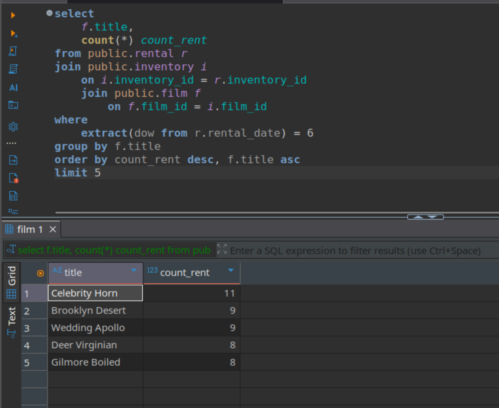

## Этап Оконные функции и простые запросы

24. Для каждой оплаты вывести сумму, дату и день недели (название дня недели текстом).
```
select 
	amount,
	payment_date,
	to_char(payment_date , 'day') as week_day
from public.payment
```
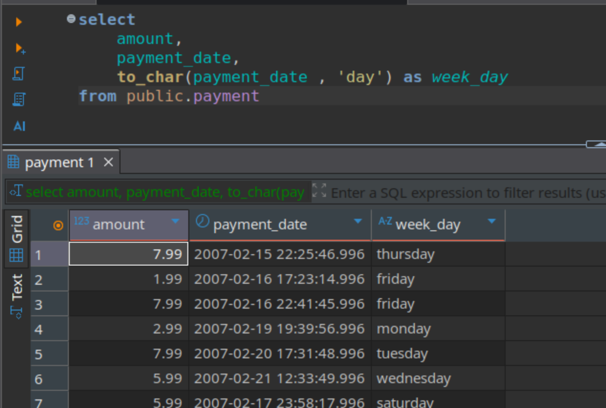

25. 
Распределить фильмы по трем категориям в зависимости от длительности:
«Короткие» — менее 70 минут;
«Средние» — от 70 минут (включительно) до 130 минут (не включая 130);
«Длинные» — от 130 минут и более.
Для каждой категории необходимо:
посчитать количество прокатов (то есть сколько раз фильмы этой категории брались в аренду);
посчитать количество фильмов, которые относятся к этой категории и хотя бы один раз сдавались в прокат.
Фильмы, у которых не было ни одного проката, не должны учитываться в подсчете количества фильмов в категории. Продумать, какой тип соединения таблиц нужно использовать, чтобы этого добиться.  
```
with film_category_by_length as (
	select 
		film_id,
		case
			when length < 70 then 'Короткие' 
			when length < 130 then 'Средние'
			else 'Длинные' 
		end as film_length_cat 	
	from public.film
)
select 
	fc_l.film_length_cat "Категория",
	count(r.rental_id) "Количество прокатов",
	count(distinct fc_l.film_id) "Количество фильмов" 
from film_category_by_length fc_l
join public.inventory i
	on fc_l.film_id = i.film_id 
	join public.rental r 
		on i.inventory_id  = r.inventory_id
group by  fc_l.film_length_cat 
```
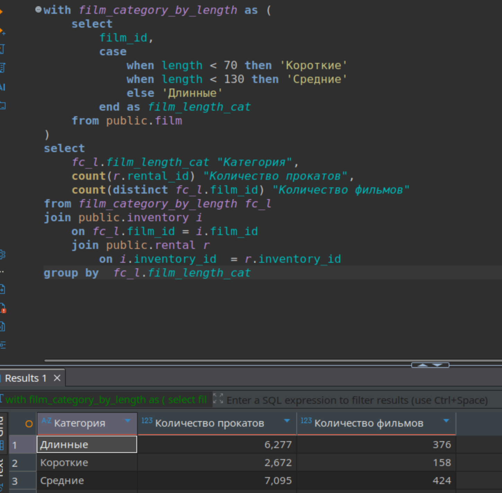

Для дальнейших заданий считать, что создана таблица weekly_revenue, в которой для каждой недели и года хранится суммарная выручка компании за эту неделю (на основании данных о прокатах и платежах).
```
create table weekly_revenue (
    year INTEGER NOT NULL,
    week INTEGER NOT NULL,
    revenue NUMERIC(10, 2) NOT NULL,
    PRIMARY KEY (year, week)
)
```
```
insert into weekly_revenue (year, week, revenue)
select 
	extract(year from payment_date) "year",
	extract(week from payment_date) "week",
	sum(amount) as revenue
from public.payment
group by year, week 
order by year, week
```
```
select * from weekly_revenue
```
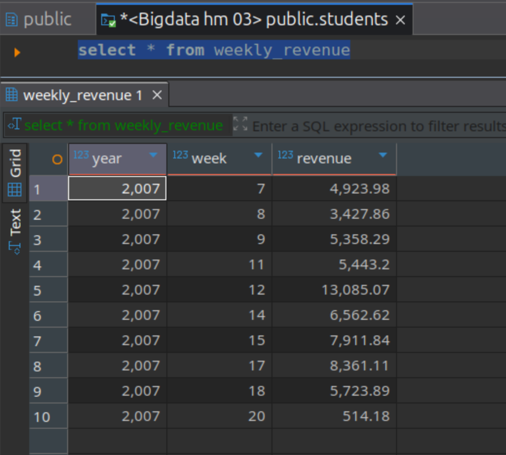

26. На основе таблицы weekly_revenue рассчитать накопленную (кумулятивную) сумму недельной выручки бизнеса. Вывести все столбцы таблицы weekly_revenue и добавить к ним столбец с накопленной выручкой. Накопленную выручку округлить до целого числа.
```
select 
	year,
	week,
	revenue,
	round(sum(revenue) over(order by year, week)) cumulative_revenue
from weekly_revenue
order by year, week
```
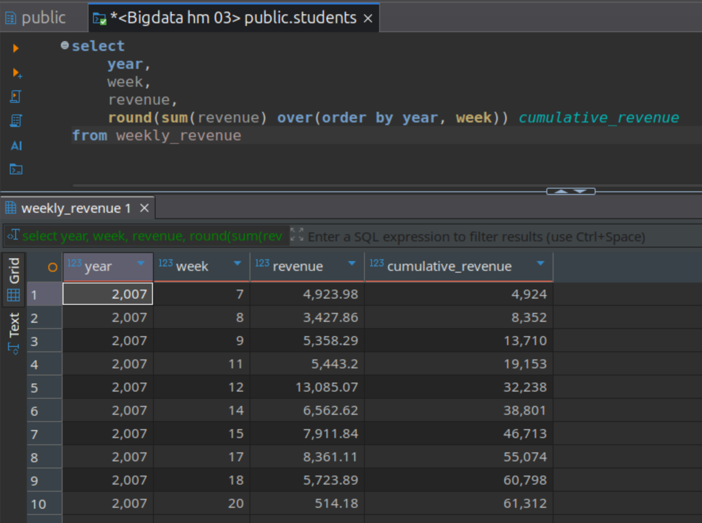

27. На основе таблицы weekly_revenue рассчитать скользящую среднюю недельной выручки, используя для расчета три недели: предыдущую, текущую и следующую. Вывести всю таблицу weekly_revenue и добавить:  
столбец с накопленной суммой выручки;
столбец со скользящей средней недельной выручки.
Скользящую среднюю округлить до целого числа.
```
select 
	year,
	week,
	revenue,
	round(sum(revenue) over(order by year, week)) cumulative_revenue,
	round(avg(revenue) over (order by year, week rows between 1 preceding and 1 following)) weekly_revenue
from weekly_revenue
order by year, week
```
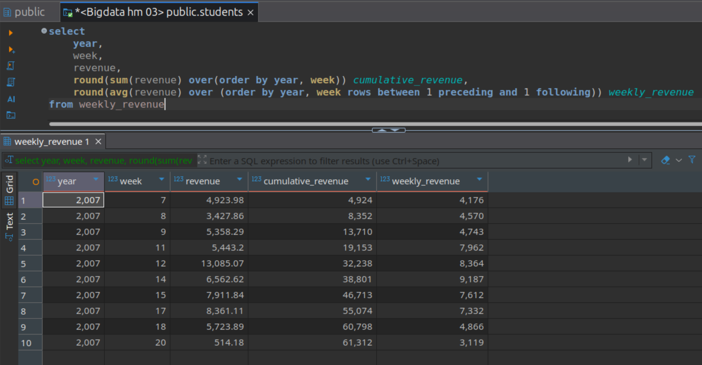

28. Рассчитать прирост недельной выручки бизнеса в процентах по сравнению с предыдущей неделей.
Прирост в процентах определяется как:  
(текущая недельная выручка – выручка предыдущей недели) / выручка предыдущей недели × 100%.
Вывести всю таблицу weekly_revenue и добавить:
​​​​​​​столбец с накопленной суммой выручки;
столбец со скользящей средней;
столбец с приростом недельной выручки в процентах.
Значение прироста в процентах округлить до двух знаков после запятой.
```
select 
	year,
	week,
	revenue,
	round(sum(revenue) over(order by year, week)) cumulative_revenue,
	round(avg(revenue) over (order by year, week rows between 1 preceding and 1 following)) moving_avg_weekly_revenue,
	round(
        (revenue - lag(revenue) over (order by year, week)) 
        / nullif(lag(revenue) over (order by year, week), 0) 
        * 100, 
        2
    ) as revenue_growth_pct
from weekly_revenue
order by year, week
```
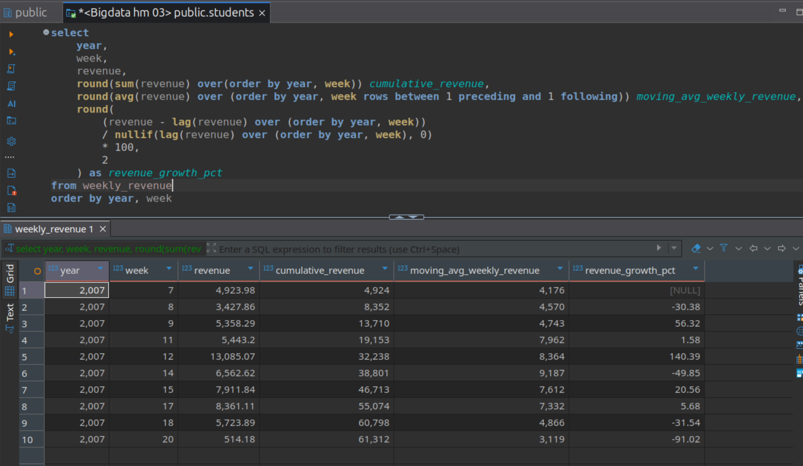
