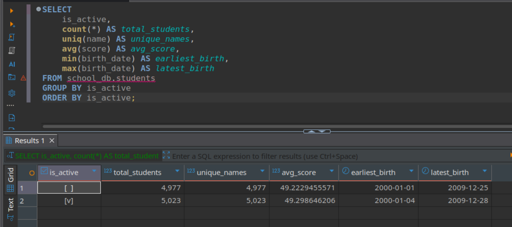
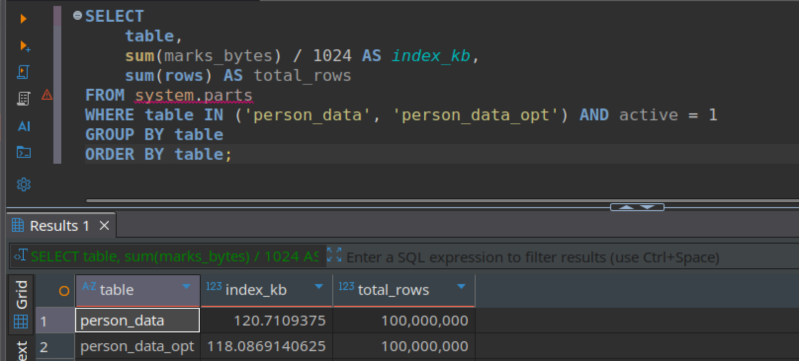

# Отчет по ДЗ 4

## Часть 1. Подготовка рабочего окружения

Создал компоуз файл
```
services:
  zookeeper:
    image: zookeeper:3.8
    container_name: zookeeper
    ports:
      - "2181:2181"
    environment:
      ZOO_STANDALONE_ENABLED: "true"
      ZOO_CLIENT_PORT: 2181
    restart: unless-stopped

  clickhouse:
    image: clickhouse/clickhouse-server:24.8
    container_name: clickhouse
    ports:
      - "8123:8123"
      - "9000:9000"
      - "9009:9009"
    volumes:
      - ./clickhouse_data:/var/lib/clickhouse
      - ./configs/zookeeper.xml:/etc/clickhouse-server/config.d/zookeeper.xml
      - ./configs/macros.xml:/etc/clickhouse-server/config.d/macros.xml
    depends_on:
      - zookeeper
    restart: unless-stopped
```

запустил командой

```
docker compose up -d
```
работоспособность проверил через
```
docker exec -it clickhouse clickhouse-client
```
вывод
```
lickHouse client version 24.8.14.39 (official build).
Connecting to localhost:9000 as user default.
Connected to ClickHouse server version 24.8.14.

0158606c1480 :) SELECT version();

SELECT version()

Query id: e5dc91a4-614f-4f89-9929-1ceac15d248b

   ┌─version()──┐
1. │ 24.8.14.39 │
   └────────────┘

1 row in set. Elapsed: 0.001 sec. 

SELECT *
FROM system.zookeeper
WHERE path = '/'

Query id: 6433454d-a820-4264-b5ff-af2dff2283f0

   ┌─name───────┬─value─┬─path─┐
1. │ zookeeper  │       │ /    │
2. │ clickhouse │       │ /    │
   └────────────┴───────┴──────┘

2 rows in set. Elapsed: 0.004 sec. 

```

## Часть 2. Практическое упражнение

Будет сделано через Dbeaver

### Упражнение 1. Запуск и проверка подключения

1. Создать базу данных
```
CREATE DATABASE IF NOT EXISTS school_db;
```
успешно
2. В созданной базе данных создать таблицу с движком MergeTree.
```
CREATE TABLE school_db.students (
    id UInt32,
    name String,
    birth_date Date,
    score Float32,
    is_active Bool,
    created_at DateTime DEFAULT now()
)
ENGINE = MergeTree
ORDER BY id;
```
успешно
3. В таблице должно быть не менее четырёх столбцов, при этом необходимо использовать различные типы данных (каждый столбец — своего типа).
```
Типы данных:

UInt32 — целое беззнаковое
String — строка
Date — дата
Float32 — число с плавающей точкой
Bool — логический
DateTime — дата и время
```
4. Заполнить таблицу тестовыми данными (генерацию данных можно выполнить по примеру, приведенному в приложении 1 или по аналогии).
```
INSERT INTO school_db.students (id, name, birth_date, score, is_active)
SELECT
    number + 1 AS id,
    concat('Student_', toString(number)) AS name,
    toDate('2000-01-01') + rand() % 3650 AS birth_date,  -- дата между 2000 и 2010
    (rand() % 1000) / 10.0 AS score,  -- от 0.0 до 99.9
    rand() % 2 AS is_active
FROM numbers(10000);
```
успешно
5. Выполнить любой аналитический запрос к созданной таблице, который включает:
   – группировку по одному из столбцов;
   – использование агрегатных функций (например, подсчёт количества уникальных значений и т.п.).
```
SELECT
    is_active,
    count(*) AS total_students,
    uniq(name) AS unique_names,
    avg(score) AS avg_score,
    min(birth_date) AS earliest_birth,
    max(birth_date) AS latest_birth
FROM school_db.students
GROUP BY is_active
ORDER BY is_active;
```


6. Проверить содержимое следующих системных таблиц ClickHouse:
   – system.clusters;
   ```
   SELECT * FROM system.clusters;
   ```
   
   – system.macros;
   ```
   SELECT * FROM system.macros;
   ```
   
   – system.zookeeper;
   ```
   SELECT * FROM system.zookeeper WHERE path = '/';
   ```
   
   – system.distributed_ddl_queue;
   ```
   SELECT * FROM system.distributed_ddl_queue;
   ```
   
   – system.replication_queue;
   ```
   SELECT * FROM system.replication_queue;
   ```
   
   – system.trace_log.
   ```
   SELECT * FROM system.trace_log;
   ```
   
7. Проверить работу следующих функций:
   – getMacro (получение значения макроса из конфигурации);
   ```
   SELECT getMacro('shard'), getMacro('replica');
   ```
   
   – clusterAllReplicas (использование функции для распределённых запросов по репликам кластера).
   ```
   SELECT * FROM clusterAllReplicas('default', 'system.one');
   ```
   
8. С использованием системных таблиц проанализировать и зафиксировать следующие метрики:
   – время выполнения запросов и объём потребляемой памяти;
    ```
    SELECT
            query,
            query_duration_ms,
            memory_usage
        FROM system.query_log
        WHERE current_database = 'school_db'
        ORDER BY event_time DESC
        LIMIT 1;
    ```
    
   – объём дискового пространства, занимаемый таблицей:
      в сжатом виде;
      в несжатом виде;
      объём, занимаемый первичным индексом;
      ```
        SELECT
            table,
            sum(bytes_on_disk) / 1024 / 1024 AS size_mb_compressed,
            sum(data_uncompressed_bytes) / 1024 / 1024 AS size_mb_uncompressed,
            sum(marks_bytes) / 1024 AS index_kb
        FROM system.parts
        WHERE database = 'school_db' AND table = 'students' AND active = 1
        GROUP BY table;
      ```
      

   – объём дискового пространства по каждому столбцу таблицы:
      в сжатом виде;
      в несжатом виде.
      ```
        SELECT
            column,
            sum(bytes_on_disk) / 1024 AS compressed_kb,
            sum(data_uncompressed_bytes) / 1024 AS uncompressed_kb
        FROM system.parts_columns
        WHERE database = 'school_db' AND table = 'students'
        GROUP BY column
        ORDER BY column;
      ```
      

### Упражнение 2. Размер вставки

8. Провести эксперимент по вставке данных в таблицы с движком MergeTree мелкими и крупными пачками.
```
CREATE DATABASE IF NOT EXISTS perf_test;
```
успешно
9. Создать две таблицы с движком MergeTree.
```
-- Таблица 1: прямая вставка мелкими пачками
CREATE TABLE perf_test.direct_table (
    id UInt64,
    event_time DateTime,
    value Float32,
    category String
)
ENGINE = MergeTree
ORDER BY event_time
PARTITION BY toYYYYMM(event_time);

-- Таблица 2: вставка через Buffer → MergeTree
CREATE TABLE perf_test.buffered_target (
    id UInt64,
    event_time DateTime,
    value Float32,
    category String
)
ENGINE = MergeTree
ORDER BY event_time
PARTITION BY toYYYYMM(event_time);
```
успешно
10. Для второй таблицы создать дополнительную таблицу с движком Buffer, через которую будет выполняться вставка данных.

```
CREATE TABLE perf_test.buffer_table (
    id UInt64,
    event_time DateTime,
    value Float32,
    category String
)
ENGINE = Buffer(
    'perf_test',               -- целевая БД
    'buffered_target',         -- целевая таблица
    16,                        -- num_layers (обычно 16)
    10,                        -- min_time (сек): мин. время удержания
    100,                       -- max_time (сек): макс. время удержания
    10000,                     -- min_rows: мин. строк для сброса
    1000000,                   -- max_rows: макс. строк в буфере
    10000000,                  -- min_bytes: ~10 MB
    100000000                  -- max_bytes: ~100 MB
);
```
успешно
11. С помощью скрипта запустить одновременную автоматическую вставку записей в обе таблицы.
    - Вставка в первую таблицу MergeTree должна выполняться мелкими пачками. 

    ```
    INSERT INTO perf_test.direct_table
    SELECT
        id,
        now() - rand() % 3600 AS event_time,
        rand() % 10000 / 10.0 AS value,
        CASE (rand() % 4)
            WHEN 0 THEN 'A'
            WHEN 1 THEN 'B'
            WHEN 2 THEN 'C'
            ELSE 'D'
        END AS category
    FROM generateRandom('id UInt64', 1, 10000000, 10000000)
    LIMIT 50;
    ```
    успешно

    - Вставка во вторую таблицу MergeTree должна выполняться крупными пачками с использованием буферизации через таблицу с движком Buffer.  
    ```
    INSERT INTO perf_test.buffer_table
    SELECT
        number AS id,
        now() - number AS event_time,
        number % 1000 AS value,
        CASE (number % 4)
            WHEN 0 THEN 'A'
            WHEN 1 THEN 'B'
            WHEN 2 THEN 'C'
            ELSE 'D'
        END AS category
    FROM numbers(5000);
    ```
    успешно

12. При желании можно добавить промежуточные таблицы и материализованные представления, которые будут генерировать случайные данные для вставки.
решил не делать
13. По завершении процесса вставки (в течение 5–10 минут) проверить итоговое количество записей в обеих целевых таблицах.
```
SELECT
    (SELECT count() FROM perf_test.direct_table) AS direct_rows,
    (SELECT count() FROM perf_test.buffered_target) AS buffered_rows;
```

14. Проверить количество активных и неактивных партиций (кусков данных) в целевых таблицах.
```
SELECT
    table,
    count() AS active_parts,
    sum(rows) AS total_rows
FROM system.parts
WHERE database = 'perf_test' AND active = 1
  AND table IN ('direct_table', 'buffered_target')
GROUP BY table
ORDER BY table;
```


```
SELECT
    table,
    count() AS inactive_parts
FROM system.parts
WHERE database = 'perf_test' AND active = 0
  AND table IN ('direct_table', 'buffered_target')
GROUP BY table
ORDER BY table;
```


### Упражнение 3. Оптимизация Order by

15. Создать таблицу в соответствии с выданным описанием (см. скрипт в приложении).
```
CREATE TABLE default.person_data (
  id          UInt64,
  region      LowCardinality(String),
  date_birth  Date,
  gender      UInt8,
  is_marital  UInt8,
  dt_create   DateTime DEFAULT now()
)
ENGINE = MergeTree()
ORDER BY (date_birth);
```
успешно

16. Заполнить таблицу сгенерированными данными, используя предоставленный скрипт.
```
INSERT INTO default.person_data(id, region, date_birth, gender, is_marital)
SELECT 
    q.id, 
    q.region, 
    toStartOfDay(q.date_birth) AS date_birth, 
    q.gender, 
    q.is_marital
FROM (
    SELECT 
        rand() AS id,
        modulo(id, 70) + 20 AS n,
        toString(n) AS region,
        floor(randNormal(10000, 1700)) AS k,
        '1970-01-01' + INTERVAL k DAY AS date_birth,
        if(modulo(id, 3) = 1, 1, 0) AS gender,
        if((n + k) % 3 = 0 AND date_diff('year', '1970-01-01' + INTERVAL k DAY, now()) > 18, 1, 0) AS is_marital
    FROM numbers(100_000_000)
) q;
```
успешно
17. Выполнить оптимизацию таблицы таким образом, чтобы в результате остался только один кусок (одна партиция).
```
OPTIMIZE TABLE default.person_data FINAL;
```
успешно
```
SELECT 
	count() as active_parts,
	sum(rows) as rows 
FROM system.parts 
WHERE table = 'person_data' AND active = 1;
```


18. Выполнить указанные запросы (см. приложение) и для каждого запроса:
   – определить среднее время выполнения на серии запусков (не менее 5);
        первый запрос - 6 мс
        второй запрос - 52 мс
   – зафиксировать количество обработанных строк (параметр PROCESSED, возвращаемый clickhouse-client);
        первый запрос - 5.7 млн
        второй запрос - 1.4 млн
   – проверить объём памяти, занимаемый первичным ключом таблицы.
   ```
    SELECT 
        sum(marks) AS marks_count,
        sum(marks_bytes) AS index_bytes,
        sum(marks_bytes) / 1024 AS index_kb
    FROM system.parts
    WHERE database = 'default' AND table = 'person_data' AND active = 1;
   ```
   

19. Оптимизировать ORDER BY и PRIMARY KEY таблицы так, чтобы:
    
    для этого нужно изменить фильтрацию и сделать ее таким образом
    ```
    ORDER BY (region, date_birth)
    ```
    для этого нужно создать новую таблицу
    ```
    CREATE TABLE default.person_data_opt (
    id          UInt64,
    region      LowCardinality(String),
    date_birth  Date,
    gender      UInt8,
    is_marital  UInt8,
    dt_create   DateTime DEFAULT now()
    )
    ENGINE = MergeTree()
    ORDER BY (region, date_birth);
    ```
    успешно

    копируем данные
    ```
    INSERT INTO default.person_data_opt
    SELECT * FROM default.person_data;
    ```
    успешно

    оптимизируем 
    ```
    OPTIMIZE TABLE default.person_data_opt FINAL;
    ```
    успешно
   – объём памяти, занимаемый первичным индексом, был минимален;
   – метрики выполнения запросов (время и объём обрабатываемых данных) улучшились.
   ```
    SELECT
        table,
        sum(marks_bytes) / 1024 AS index_kb,
        sum(rows) AS total_rows
    FROM system.parts
    WHERE table IN ('person_data', 'person_data_opt') AND active = 1
    GROUP BY table
    ORDER BY table;
   ```
   

### Упражнение 4. Сжатие данных
20. На основании таблицы, полученной в результате выполнения задания 2, создать новую таблицу с той же структурой и теми же данными.
```
CREATE TABLE default.person_data_codec (
  id          UInt64     CODEC(ZSTD(3)),
  region      LowCardinality(String) CODEC(ZSTD(3)),
  date_birth  Date       CODEC(Delta, ZSTD(3)),
  gender      UInt8      CODEC(T64, ZSTD(3)),
  is_marital  UInt8      CODEC(T64, ZSTD(3)),
  dt_create   DateTime   CODEC(Delta, ZSTD(3))
)
ENGINE = MergeTree()
ORDER BY (region, date_birth);
```
успешно

вставка данных
```
INSERT INTO default.person_data_codec
SELECT * FROM default.person_data;
```
успешно

оптимизация
```
OPTIMIZE TABLE default.person_data_codec FINAL;
```
успешно
21. Подобрать кодеки сжатия для столбцов новой таблицы таким образом, чтобы выполнялись следующие условия:
• общий объём, занимаемый таблицей на диске, уменьшился не менее чем на 25 % по сравнению с исходной таблицей;
```
SELECT
    table,
    sum(rows) AS rows_total,
    sum(bytes_on_disk) / 1024 / 1024 AS size_mb,
    sum(data_uncompressed_bytes) / 1024 / 1024 AS uncompressed_mb
FROM system.parts
WHERE table IN ('person_data', 'person_data_codec') AND active = 1
GROUP BY table
ORDER BY table;
```


• среднее время выполнения обоих рассматриваемых запросов не увеличилось более чем на 10–15 %, при этом желательно, чтобы оно улучшилось.
 - первый запрос без изменений
 - второй запрос увеличился на 11%

Дополнительное задание на +1 балл к оценке по дз.
 Продумать и описать дополнительные способы оптимизации структуры таблицы и/или самих запросов с целью ускорения их выполнения.

* Партиционирование по region или году
```
ORDER BY (region, date_birth)
PARTITION BY (region, toYYYYMM(date_birth))
```
* Замена DateTime на Date + UInt32 секунды


